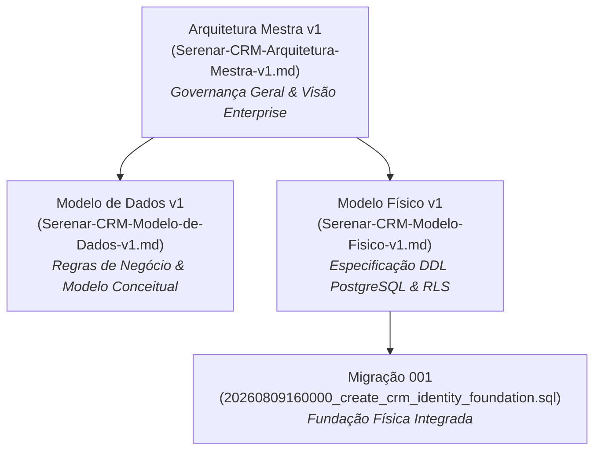
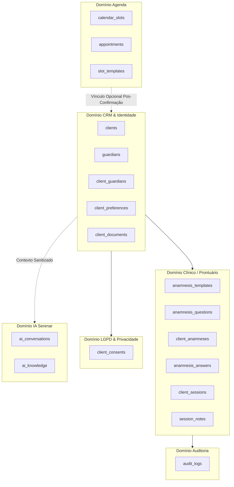
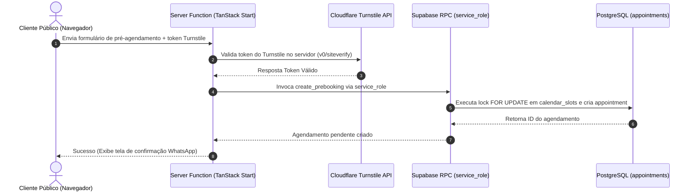
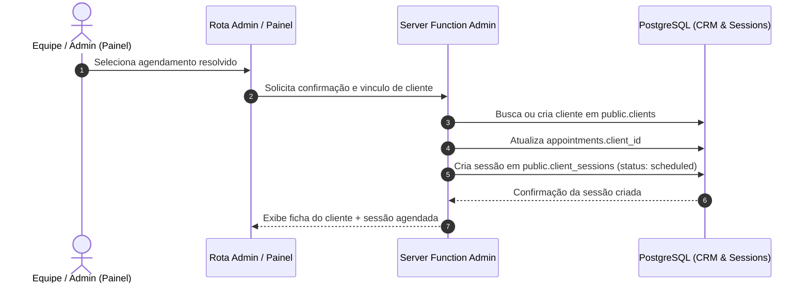
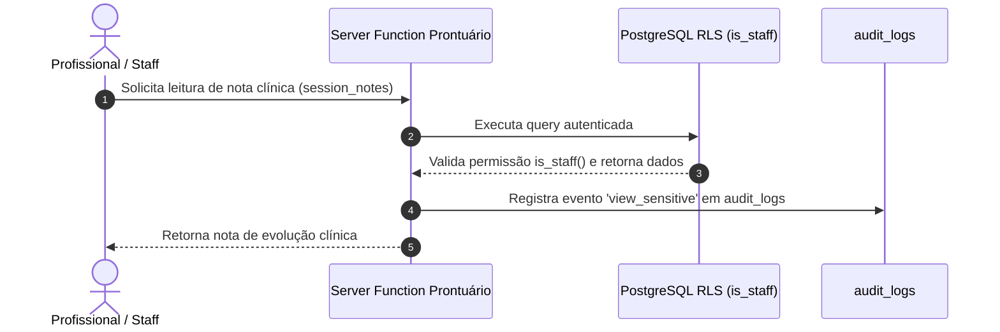

# Serenar CRM — Arquitetura Mestra v1

> **Status:** APROVADO / GOVERNANÇA OFICIAL
> **Versão:** 1.0
> **Data:** 11 de Agosto de 2026
> **Projeto:** Serenar Bem-Estar
> **Repositório:** `44CodeSimone/serenar-bemestar`
> **Safe Point Git:** `ba358cc` (`feat: add CRM identity foundation migration 001`)

---

## 1. Propósito e Escopo

### 1.1 Objetivo deste Documento
Este documento estabelece a **Arquitetura Mestra v1 do Serenar CRM**, consolidando as diretrizes, princípios, domínios, fronteiras de segurança, controles de privacidade e estratégias de evolução técnica para o sistema de gestão de relacionamento e histórico de atendimento da Serenar Bem-Estar.

Ele atua como a autoridade arquitetural suprema para orientar arquitetos, desenvolvedores sêniores, engenheiros de dados e auditores antes do início de qualquer ciclo de implementação ou evolução de schema.

### 1.2 Hierarquia Documental e Referências Oficiais
A arquitetura do Serenar CRM é regida pela seguinte estrutura documental complementar:



1. **`Serenar-CRM-Arquitetura-Mestra-v1.md` (Este documento):** Governa a visão estratégica, os contratos entre camadas, a matriz de segurança, a LGPD, o desacoplamento de domínios e a governança de evolução.
2. **`Serenar-CRM-Modelo-de-Dados-v1.md`:** Governa os conceitos de negócio, entidades, relacionamentos conceituais, regras operacionais e limites regulatórios de privacidade.
3. **`Serenar-CRM-Modelo-Fisico-v1.md`:** Governa a implementação física no banco de dados PostgreSQL, especificando tabelas, tipos controlados, restrições `CHECK`, políticas RLS, índices e chaves estrangeiras.
4. **`20260809160000_create_crm_identity_foundation.sql`:** Script SQL da Migração 001 que materializa a fundação de identidade cadastral (`clients`, `guardians`, `client_guardians`).

---

## 2. Visão Executiva do CRM

### 2.1 Contexto e Desafio de Negócio
O Serenar Bem-Estar é um espaço especializado em massoterapia, rituais de bem-estar e cuidados holísticos localizado em Urubici/SC. Atualmente, o sistema opera com uma infraestrutura web estável baseada em React 19, Vite, TanStack Start, Supabase PostgreSQL e Edge Functions para disponibilidade e agendamentos.

A evolução para o Serenar CRM responde à necessidade de centralizar o histórico de atendimento dos clientes, organizar a gestão de responsáveis legais de menores, versionar formulários de anamnese, registrar evoluções terapêuticas e oferecer suporte inteligente via assistente virtual (IA Serenar), garantindo a proteção de dados pessoais e o histórico do cliente.

### 2.2 Posição Arquitetural no Ecossistema Serenar
O CRM opera como o **núcleo de identidade e histórico** do ecossistema Serenar, atuando de forma desacoplada dos canais de atração pública (site institucional e agendamento) e do motor de disponibilidade (Agenda).

```text
+-----------------------------------------------------------------------------------+
|                                 CANAL PÚBLICO WEB                                 |
|         (Formulário de Pré-Agendamento / Chat IA / Institucional / Blog)          |
+-----------------------------------------------------------------------------------+
                                          │
                                          ▼
+-----------------------------------------------------------------------------------+
|                                MOTOR DE AGENDA                                    |
|              (calendar_slots / appointments / slot_templates)                     |
+-----------------------------------------------------------------------------------+
                                          │ (Confirmação Administrativa)
                                          ▼
+-----------------------------------------------------------------------------------+
|                                NÚCLEO DO CRM                                      |
|    (clients / guardians / client_anamneses / client_sessions / session_notes)     |
+-----------------------------------------------------------------------------------+
```

---

## 3. Princípios Arquiteturais Permanentes

A arquitetura do Serenar CRM é sustentada pelos seguintes princípios permanentes e imutáveis:

### P-01: Governança de Arquitetura antes da Implementação
Nenhuma tabela, coluna, função, RPC ou rota de código pode ser adicionada sem prévia especificação documental e aprovação do plano de arquitetura.

### P-02: Isolamento de Domínio e Desacoplamento
Cada domínio de negócio (CRM, Agenda, Clínico, IA) possui fronteiras claras. O desacoplamento garante que alterações no formulário público de pré-agendamento ou na agenda não afetem a integridade do histórico do CRM.

### P-03: Defesa em Profundidade (*Defense in Depth*)
A segurança é aplicada em múltiplas camadas:
1. Validação de esquemas e dados na camada de aplicação.
2. Proteção de borda contra automação maliciosa (Cloudflare Turnstile e Honeypot).
3. Autenticação e autorização em Server Functions (TanStack Start / Node.js).
4. Isolamento de RPCs privilegiadas restritas a `service_role`.
5. Validação rigorosa e Row Level Security (RLS) no PostgreSQL.

### P-04: Transações Históricas Não Destrutivas (*Append-Only*)
Prontuários, respostas de anamnese, registros de sessão e consentimentos LGPD não são sobrescritos. Alterações ou retificações ocorrem via registros encadeados (`supersedes_note_id`) ou controle de vigência (`valid_until`, `revoked_at`).

### P-05: Restrição de Exclusão Física (*No Cascading Deletes*)
É estritamente proibido o uso de `ON DELETE CASCADE` em tabelas do CRM que armazenem histórico de atendimento, anamneses, consentimentos ou identificação. A remoção de dependências utiliza `ON DELETE RESTRICT` ou `ON DELETE SET NULL` em referências operacionais opcionais.

### P-06: Zero Downtime & Tipos Controlados via `CHECK` Constraints
Para evitar bloqueios exclusivos de tabelas (*DDL locks*) e permitir migrações seguras em produção, o banco de dados adota colunas do tipo `text` com restrições `CHECK` em substituição às enums nativas do PostgreSQL.

### P-07: Proibição de Acesso Direto do Navegador a Operações Privilegiadas
Nenhuma chave `service_role` ou RPC administrativa pode ser invocada diretamente pelo navegador do cliente. Todas as operações privilegiadas passam por Server Functions autenticadas.

---

## 4. Mapa de Domínios

O ecossistema do Serenar CRM é composto por sete domínios de responsabilidade bem delimitados:



### 4.1 Descrição dos Domínios

| Domínio | Responsabilidade Principal | Tabelas Principais | O que NÃO Pertence ao Domínio |
| :--- | :--- | :--- | :--- |
| **CRM & Identidade** | Gestão do cadastro civil do cliente, responsáveis legais e preferências. | `clients`, `guardians`, `client_guardians`, `client_preferences`, `client_documents` | Agendamento de horários, perguntas de anamnese, conversas de IA. |
| **Agenda** | Controle de vagas públicas, exceções de calendário e pré-agendamentos. | `calendar_slots`, `slot_templates`, `slot_exceptions`, `appointments` | Ficha clínica, diagnóstico, prontuário, preferências do cliente. |
| **Clínico / Prontuário** | Modelagem de anamneses, respostas, sessões realizadas e notas de evolução. | `anamnesis_templates`, `anamnesis_questions`, `client_anamneses`, `anamnesis_answers`, `client_sessions`, `session_notes` | Venda de pacotes, reserva de horário público, dados financeiros. |
| **LGPD & Privacidade** | Registro de bases legais, termos aceitos e revogação de consentimentos. | `client_consents` | Dados de agendamento de vagas, evolução clínica. |
| **Auditoria** | Trilha imutável de eventos sensíveis e acessos operacionais. | `audit_logs` | Modificação de estado de regras de negócio. |
| **IA Serenar** | Atendimento conversacional assistido e tira-dúvidas público/privado. | `ai_conversations`, `ai_knowledge` | Gravação direta de anamnese, alteração de prontuário, acesso direto ao BD. |

---

## 5. Fronteiras e Responsabilidades

### 5.1 Regra Fundamental de Fluxo
A arquitetura impõe uma cadeia de responsabilidades unidirecional para qualquer interação de escrita ou leitura no sistema:

```text
[ Interface UI / Componente React ]
               │
               ▼ (Invocação de Action)
[ Rota / Page Component (TanStack Router) ]
               │
               ▼ (Requisição HTTP segura)
[ Server Function (TanStack Start / Node.js) ]
               │
               ├─► [ Validação de Esquema e Dados na Aplicação ]
               ├─► [ Verificação de Segurança (Turnstile / Honeypot) ]
               └─► [ Checagem de Autenticação / Autorização (is_staff) ]
               │
               ▼ (Chave Privada service_role)
[ Repository / Supabase Admin RPC ]
               │
               ▼ (Validação SQL e RLS)
[ PostgreSQL Database (Supabase) ]
```

### 5.2 Acessos Proibidos
1. **Frontend → PostgreSQL com bypass de Server Function para operações sensíveis:** É proibida a inserção direta de registros clínicos ou alterações de consentimento via cliente Supabase público.
2. **IA Serenar → Conexão direta com Banco de Dados:** A IA não possui credenciais de banco e não pode executar consultas SQL diretamente.
3. **Agenda → Mutação Direta de Prontuário:** A criação ou cancelamento de um pré-agendamento em `appointments` não pode alterar diretamente `client_sessions` ou `session_notes`.

---

## 6. Arquitetura de Identidade

### 6.1 Identidade Técnica vs Identidade Civil
- **Identidade Técnica Primária:** Todo registro de cliente é identificado univocamente por um UUID v4 gerado nativamente pelo banco de dados (`clients.id DEFAULT gen_random_uuid()`).
- **Identidade Civil:** Representada pelo CPF do cliente (`clients.cpf`).

### 6.2 Regras do CPF no Cliente
1. **Armazenamento:** Salvo como `text` normalizado (apenas 11 dígitos numéricos, sem pontos ou traços).
2. **Nulabilidade:** O campo `clients.cpf` é **opcional (`NULLable`)** no cadastro do cliente. Isso permite o atendimento inicial de menores de idade sem documento próprio ou clientes estrangeiros.
3. **Unicidade Parcial:** Quando o CPF for informado, ele deve ser estritamente único no sistema. Isso é garantido pelo índice único parcial:
   ```sql
   CREATE UNIQUE INDEX uq_clients_cpf ON public.clients (cpf) WHERE cpf IS NOT NULL;
   ```
4. **Impedimento de Re-cadastro em Fichas Arquivadas:** Se uma ficha for arquivada (`status = 'archived'` ou `deleted_at IS NOT NULL`), o CPF permanece registrado na tabela. O sistema impede a criação de uma nova ficha com o mesmo CPF, exigindo a restauração administrativa da ficha arquivada.

### 6.3 Distinção entre Pessoas e Usuários

```mermaid
classDiagram
    class AuthUser {
        +UUID id
        +String email
    }
    class Profile {
        +UUID id
        +String full_name
    }
    class Client {
        +UUID id
        +UUID auth_user_id (Nullable)
        +String full_name
        +String cpf (Nullable)
    }
    class Guardian {
        +UUID id
        +String full_name
        +String cpf (Mandatory)
    }
    class Lead {
        +UUID id
        +UUID converted_client_id (Nullable)
        +String full_name
    }

    AuthUser <|-- Profile : 1:1
    AuthUser "0..1" -- "0..1" Client : Vinculo Opcional
    Client "1" -- "0..*" Guardian : client_guardians (N:N)
    Lead "0..1" -- "0..1" Client : Converte Em
```

- **`auth.users`:** Credencial de autenticação mantida pelo Supabase Auth.
- **`profiles`:** Metadados da conta autenticada no sistema.
- **`clients`:** Ficha cadastral da pessoa física atendida nos rituais e terapias. Não exige conta em `auth.users`.
- **`leads`:** Registro temporário de prospecção de marketing, podendo ser convertido em cliente via preenchimento de `converted_client_id`.

---

## 7. Cadastro Central de Clientes

### 7.1 Responsabilidade Arquitetural
O módulo de Cadastro Central é a fonte da verdade para a ficha cadastral do cliente no Serenar CRM.

### 7.2 Invariantes do Cadastro Central
1. Toda pessoa atendida nos rituais deve possuir uma única ficha ativa em `clients`.
2. A alteração de dados cadastrais (nome, telefone, e-mail, endereço) atualiza a ficha central e não modifica os dados históricos de atendimentos passados gravados em `appointments` ou `session_notes`.
3. O histórico de preferências (alergias, aromas preferidos, restrições físicas) é armazenado na tabela `client_preferences` como chave/valor JSONB vinculada a `client_id`.

---

## 8. Responsáveis Legais e Dependentes

### 8.1 Modelagem da Representação Legal
O atendimento a clientes menores de idade ou dependentes legais é suportado pela estrutura desacoplada entre `guardians` e a tabela de junção `client_guardians`.

### 8.2 Estrutura Física de Responsáveis
- **`guardians`:** Tabela independente de responsáveis legais. Exige CPF obrigatório e único (`uq_guardians_cpf`).
- **`client_guardians`:** Junção N:N contendo:
  - Tipo de vínculo (`relationship`): `mother`, `father`, `tutor`, `guardian`, `other`.
  - Indicador de responsável principal (`is_primary`).
  - Confirmação de autorização legal (`legal_authority_confirmed`).
  - Controle temporal de vigência (`valid_from`, `valid_until`, `revoked_at`).

### 8.3 Invariante de Responsável Principal Ativo
Para evitar conflitos de representação, o sistema garante que cada cliente tenha no máximo um responsável principal simultaneamente ativo através do índice:
```sql
CREATE UNIQUE INDEX uq_client_guardians_primary_active
ON public.client_guardians (client_id)
WHERE is_primary = true AND revoked_at IS NULL AND valid_until IS NULL;
```

---

## 9. Profissionais e Modelo de Autorização

### 9.1 Estado Atual da Base de Dados
Atualmente, a enum `app_role` no banco de dados contempla os seguintes papéis:
- `admin`: Administrador do sistema Serenar.
- `owner`: Proprietária / Gestora principal (Mariah Luz).
- `client`: Cliente autenticado no portal.

### 9.2 Autorização Corrente de Equipe
As verificações de acesso administrativo e clínico no banco de dados utilizam a função auxiliar `public.is_staff(user_id)`, que retorna verdadeiro para usuários com papel `admin` ou `owner`.

### 9.3 Papel Profissional Futuro
O papel `professional` **não existe** na migração inicial 001 e não deve ser inventado de forma prematura. A especificação de escopos clínicos para terapeutas colaboradores é mantida como decisão aberta (`OPEN-001`) para ser tratada em migração posterior.

---

## 10. Agenda × CRM

### 10.1 Desacoplamento Estrito
O domínio de Agenda (`calendar_slots`, `appointments`) é arquiteturalmente independente do domínio do CRM (`clients`, `client_sessions`).

```text
[ Formulário de Pré-Agendamento Público ]
                    │
                    ▼ (Gravação de Snapshots)
      [ public.appointments ]
        (full_name, phone, email, notes)
                    │
                    ▼ (Confirmação Administrativa no Painel)
    ┌───────────────────────────────┐
    │ O cliente já existe em        │
    │ public.clients?               │
    └───────────────┬───────────────┘
                    │
           ┌────────┴────────┐
           ▼                 ▼
        ( SIM )           ( NÃO )
           │                 │
           │                 ▼
           │          [ Criar Registro em ]
           │          [  public.clients   ]
           │                 │
           └────────┬────────┘
                    │
                    ▼
     [ Vincular appointments.client_id ]
                    │
                    ▼
     [ Criar public.client_sessions ]
```

### 10.2 Mecanismo de Ponte
- A tabela `appointments` possui as colunas anuláveis `client_id` (FK para `clients`, `ON DELETE SET NULL`) e `service_id` (FK para `services`, `ON DELETE SET NULL`).
- Os campos textuais em `appointments` (`full_name`, `phone`, `email`, `service`, `preferred_date`, `preferred_time`, `notes`) são **snapshots imutáveis** do momento da solicitação e permanecem preservados para auditoria e retrocompatibilidade.

---

## 11. Atendimento e Sessões

### 11.1 Diferenciação de Entidades

| Entidade | Conceito | Momento de Criação | Ciclo de Vida |
| :--- | :--- | :--- | :--- |
| `appointments` | Solicitação de reserva de horário pelo cliente. | Pré-agendamento no site ou WhatsApp. | `pending` → `confirmed` → `completed` / `cancelled` |
| `client_sessions` | Atendimento terapêutico/clínico efetivamente realizado. | Pós-confirmação administrativa ou início do atendimento. | `scheduled` → `in_progress` → `completed` / `no_show` |
| `session_notes` | Anotações e evolução terapêutica registradas pelo profissional. | Durante ou imediatamente após a sessão. | Imutável (encadeado via `supersedes_note_id`) |

---

## 12. Prontuário e Anamnese

### 12.1 Estrutura de Formulários Versionados
- **`anamnesis_templates`:** Cabeçalho do modelo de anamnese (`name`, `version`, `status`). A alteração de um formulário ativo incrementa a versão (`version + 1`) e desativa a anterior (`status = 'retired'`).
- **`anamnesis_questions`:** Perguntas individuais ligadas a um template. Identificadas por uma chave estável `question_key` e vinculadas à versão específica.

### 12.2 Execução e Respostas de Anamnese
- **`client_anamneses`:** Registro da aplicação de uma anamnese a um cliente (`client_id`, `template_id`, `filled_by`, `status`).
- **`anamnesis_answers`:** Respostas estruturadas armazenadas em JSONB (`answer_value`), obrigatoriamente vinculadas à pergunta exata (`question_id`).

### 12.3 Evolução Clínica Imutável (`session_notes`)
A anotação de evolução terapêutica é protegida contra sobrescrita acidental. Caso o profissional precise corrigir uma anotação, o sistema insere uma nova linha em `session_notes` referenciando a nota anterior pelo campo `supersedes_note_id`.

---

## 13. Documentos do Cliente

### 13.1 Arquitetura de Mídias e Anexos
A gestão de arquivos privados do cliente (exames, laudos, fotos de acompanhamento) adota o padrão de metadados em banco e arquivos em bucket privado:

```text
[ Upload de Documento ]
           │
           ▼
[ Bucket Privado para Documentos do CRM ]
           │
           ▼ (Gravação de Caminho Seguro)
[ public.client_documents ]
  - storage_path (ex: "client-uuid/docs/file.pdf")
  - mime_type
  - file_size_bytes
           │
           ▼ (Visualização no Painel)
[ Geração de Signed URL Temporária (TTL: 60 min) ]
```

### 13.2 Regras de Acesso
- O bucket privado destinado aos documentos do CRM é estritamente de acesso restrito.
- O acesso de leitura exige geração de URL assinada temporária (*Signed URL*) processada no servidor via Server Function.
- Exclusões físicas no bucket utilizam `ON DELETE RESTRICT` na tabela de metadados para impedir orfanamento de arquivos.

---

## 14. LGPD e Governança de Dados

### 14.1 Ledger de Consentimento Imutável (`client_consents`)
O consentimento do cliente é registrado de forma granular na tabela `client_consents`:
- **Categorias:** `data_processing`, `service_authorization`, `guardian_authorization`, `document_storage`, `ai_memory`, `marketing`, `image_use`, `testimonial_use`.
- **Modo *Append-Only*:** A revogação de um consentimento preenche `revoked_at = now()` sem deletar o registro histórico da concessão anterior.
- **Evidências:** Armazena a versão do termo (`term_version`), o hash do documento (`term_hash`) e o canal de coleta (`collection_channel`).

### 14.2 Minimização e Proteção de Dados Sensíveis
1. O CPF não é exibido em logs de auditoria, mensagens de erro públicas ou prompts de IA.
2. A recusa de consentimento para marketing ou memória da IA não bloqueia a prestação dos serviços de massoterapia.

---

## 15. Segurança

### 15.1 Matriz de Permissões e RLS

```text
+-----------------------+-------------------+--------------------+--------------------+
| Tabela                | Papel Anônimo     | Cliente Autenticado| Equipe (is_staff)  |
+-----------------------+-------------------+--------------------+--------------------+
| clients               | NENHUM (Denied)   | SELECT (Próprio)   | ALL (Full Access)  |
| guardians             | NENHUM (Denied)   | NENHUM (Denied)    | ALL (Full Access)  |
| client_guardians      | NENHUM (Denied)   | NENHUM (Denied)    | ALL (Full Access)  |
| client_preferences    | NENHUM (Denied)   | SELECT (Próprio)   | ALL (Full Access)  |
| client_consents       | NENHUM (Denied)   | SELECT (Próprio)   | ALL (Full Access)  |
| anamnesis_*           | NENHUM (Denied)   | NENHUM (Denied)    | ALL (Full Access)  |
| client_sessions       | NENHUM (Denied)   | SELECT (Próprio)   | ALL (Full Access)  |
| session_notes         | NENHUM (Denied)   | NENHUM (Denied)    | ALL (Full Access)  |
| client_documents      | NENHUM (Denied)   | NENHUM (Denied)    | ALL (Full Access)  |
| audit_logs            | NENHUM (Denied)   | NENHUM (Denied)    | ALL (is_admin)     |
+-----------------------+-------------------+--------------------+--------------------+
```

### 15.2 Proibições de Segurança
- **Proibido:** Invocação da chave `service_role` no código do cliente browser.
- **Proibido:** Leitura pública anônima direta em qualquer tabela do CRM ou prontuário.
- **Proibido:** Concessão de permissões de escrita direta em notas de evolução clínica para clientes.

---

## 16. Auditoria e Rastreabilidade

### 16.1 Tabela Transversal (`audit_logs`)
A rastreabilidade de eventos sensíveis é centralizada na tabela `audit_logs`:
- **Ações Registradas:** `create`, `update`, `archive`, `restore`, `revoke`, `view_sensitive`, `export`, `other`.
- **Independência de Referência:** Os campos `entity_type`, `entity_id` e `client_id` são mantidos como identificadores lógicos em texto/UUID sem Foreign Keys físicas, impedindo que acoplamentos de banco de dados travem a limpeza ou integridade dos logs.
- **Imutabilidade Absoluta:** Políticas RLS bloqueiam qualquer tentativa de `UPDATE` ou `DELETE` em `audit_logs`.

---

## 17. IA Serenar no CRM

### 17.1 Modelo de Isolamento e Privacidade
A assistente virtual IA Serenar atua sob regras estritas de isolamento lógico:

```text
[ Cliente / Usuário no Chat ]
              │
              ▼
[ Server Function de Chat (serena.functions.ts) ]
              │
              ├─► 1. Valida Consentimento 'ai_memory' em client_consents
              ├─► 2. Sanitiza Payload (Remove CPF, exames, notas restritas)
              └─► 3. Monta Prompt de Contexto Mínimo Autorizado
              │
              ▼
[ Provedor externo de LLM (API da IA) ]
```

### 17.2 Diretrizes da IA no CRM
1. **Sem Acesso Direto ao Banco:** A IA não possui credenciais do PostgreSQL e não executa queries.
2. **Contexto Sanitizado:** O histórico do cliente só é enviado à IA se houver consentimento ativo (`client_consents.consent_type = 'ai_memory'`).
3. **Dados Proibidos para a IA:** É proibido enviar à IA: CPF, respostas brutas de anamneses médicas, documentos PDF anexados e endereços residenciais completos.
4. **Persistência de Conversas:** A tabela `ai_conversations` exige `user_id NOT NULL`. Conversas anônimas de visitantes públicos no site não são gravadas no banco de dados.

---

## 18. Fluxos Arquiteturais Principais

### 18.1 Fluxo A — Pré-Agendamento Público (Manutenção da Produção)



### 18.2 Fluxo B — Atendimento Integrado (Visão Evolutiva Futura)



### 18.3 Fluxo C — Acesso a Dados Sensíveis do Prontuário



---

## 19. Contratos entre Camadas

A responsabilidade técnica de cada camada da aplicação é delimitada da seguinte forma:

```text
+------------------------+------------------------------------------------------------------+
| Camada                 | Responsabilidade Técnica                                         |
+------------------------+------------------------------------------------------------------+
| Interface (UI)         | Renderização de componentes React, formulários e feedbacks visual.|
| Rota (TanStack Router) | Gerenciamento de navegação, roteamento e schemas de URL.          |
| Server Function        | Orquestração server-side, validação da camada de aplicação, autenticação e Turnstile.|
| Repository             | Métodos de abstração de acesso ao banco e cliente Supabase Admin.|
| RPC PostgreSQL         | Execução de transações atômicas complexas com lock e validação.  |
| PostgreSQL / RLS       | Persistência física, integridade referencial e barreira RLS final. |
+------------------------+------------------------------------------------------------------+
```

---

## 20. Compatibilidade e Evolução

### 20.1 Garantia de Zero Downtime
1. Nenhuma alteração pode remover colunas ativas ou alterar tipos de dados em produção sem um período de depreciação de pelo menos uma versão.
2. A criação de tabelas e índices utiliza `IF NOT EXISTS` para evitar falhas durante repetições de deploys de CI/CD.
3. As migrações são estritamente incrementais.

---

## 21. Decisões Arquiteturais Consolidadas

| ID | Decisão Arquitetural | Estado | Evidência Documental |
| :--- | :--- | :--- | :--- |
| **ARC-001** | Entidade `clients` como identificador central de clientes, independente de `auth.users`. | CONSOLIDADO | `Modelo-de-Dados-v1.md` (Seção 3) |
| **ARC-002** | Chaves primárias físicas utilizando UUID v4 gerado por `gen_random_uuid()`. | CONSOLIDADO | `Modelo-Fisico-v1.md` (Seção 3) |
| **ARC-003** | CPF mantido como `text` normalizado em 11 dígitos, opcional no cliente e único quando informado. | CONSOLIDADO | `Modelo-Fisico-v1.md` (Seção 7) |
| **ARC-004** | Utilização de restrições `CHECK` em colunas `text` em substituição a `ENUM`s nativas do PostgreSQL. | CONSOLIDADO | `Modelo-Fisico-v1.md` (Seção 4) |
| **ARC-005** | Proibição de `ON DELETE CASCADE` para dados de clientes, consentimentos e histórico clínico. | CONSOLIDADO | `Modelo-Fisico-v1.md` (Seção 15) |
| **ARC-006** | Desacoplamento entre os domínios de Agenda (`appointments`) e CRM (`clients`). | CONSOLIDADO | `Modelo-de-Dados-v1.md` (Seção 7.3) |
| **ARC-007** | Versionamento de formulários de anamnese com preservação de perguntas legadas. | CONSOLIDADO | `Modelo-Fisico-v1.md` (Seção 9) |
| **ARC-008** | Evolução médica imutável encadeada por `supersedes_note_id` na tabela `session_notes`. | CONSOLIDADO | `Modelo-Fisico-v1.md` (Seção 10) |
| **ARC-009** | Ledger de consentimento LGPD *append-only* com revogação por preenchimento de `revoked_at`. | CONSOLIDADO | `Modelo-Fisico-v1.md` (Seção 12) |
| **ARC-010** | Armazenamento de arquivos privados em bucket de armazenamento restrito com URLs assinadas temporárias. | CONSOLIDADO | `Modelo-Fisico-v1.md` (Seção 11) |
| **ARC-011** | RPC `create_prebooking` restrita estritamente ao papel `service_role`. | CONSOLIDADO | Migração `20260803001147` |
| **ARC-012** | Roadmap de migração física dividida em 6 etapas independentes (Mig 001 a Mig 006). | CONSOLIDADO | `Modelo-Fisico-v1.md` (Seção 17) |

---

## 22. Decisões Arquiteturais Abertas

### OPEN-001 — Modelagem do Papel Profissional no `app_role`
- **Estado atual:** A enum `app_role` contém apenas `admin`, `owner` e `client`.
- **Problema:** Profissionais colaboradores (terapeutas) necessitam de escopos de acesso clínicos sem privilégios de administração global do sistema.
- **Impacto:** Exige a introdução de uma migração específica para incluir o valor `'professional'` em `app_role` e ajustar as políticas RLS do domínio clínico.
- **Momento adequado para decisão:** Decisão futura, a ser resolvida quando a capacidade do domínio profissional for introduzida.

### OPEN-002 — Protocolo de Backfill e Resolução de Duplicidades em Agendamentos Antigos
- **Estado atual:** Os agendamentos legados em `appointments` possuem dados textuais sem `client_id`.
- **Problema:** A vinculação automática por CPF ou telefone pode gerar associações incorretas se houver erros de digitação históricos.
- **Impacto:** Exige a criação de uma interface administrativa para confirmação manual de vínculo de clientes antigos.
- **Momento adequado para decisão:** Decisão futura, a ser resolvida antes da integração entre os domínios de Agenda e CRM.

### OPEN-003 — Política de Retenção e Exclusão Definitiva LGPD
- **Estado atual:** O sistema adota arquivamento lógico (`status = 'archived'`).
- **Problema:** A legislação prevê o direito ao esquecimento e descarte definitivo de dados quando não houver obrigação legal de guarda.
- **Impacto:** Necessidade de definir um procedimento automatizado de anonimização ou expurgo físico auditado.
- **Momento adequado para decisão:** Decisão futura, a ser resolvida na formalização das políticas de governança e descarte de dados.

### OPEN-004 — Regras de Acesso de Responsáveis Legais a Prontuários de Menores
- **Estado atual:** O vínculo jurídico está estabelecido em `client_guardians`.
- **Problema:** Falta definir as regras de visibilidade de notas de atendimento quando o cliente atinge a maioridade civil ou em casos de emancipação.
- **Impacto:** Ajuste fino de Server Functions e RLS para clientes dependentes.
- **Momento adequado para decisão:** Decisão futura, a ser resolvida na especificação das regras de prontuário e representação legal.

### OPEN-005 — Persistência de Conversas Públicas Anônimas na IA Serenar
- **Estado atual:** `ai_conversations.user_id` é `NOT NULL` (exige usuário autenticado).
- **Problema:** Conversas de visitantes anônimos no chat público do site não são gravadas no banco de dados.
- **Impacto:** Se o negócio desejar capturar leads diretamente pelo chat da IA, será necessário um modelo de sessão temporária ou tabela de conversas anônimas.
- **Momento adequado para decisão:** Decisão futura, a ser resolvida na especificação do suporte estendido à assistente virtual.

---

## 23. Riscos Arquiteturais e Guardrails

| Risco Arquitetural | Impacto de Negócio | Guardrail de Proteção | Estado |
| :--- | :--- | :--- | :--- |
| **Duplicidade de cadastros sem CPF** | Fichas duplicadas para o mesmo cliente sem documento. | Consulta de duplicidade por nome + data de nascimento + nome da mãe na Server Function de cadastro. | Guardrail Ativo |
| **Acoplamento prematuro entre Agenda e CRM** | Falha no pré-agendamento público devido a erros de cadastro no CRM. | Preservação de snapshots em `appointments` e vínculo `client_id` anulável (`SET NULL`). | Guardrail Ativo |
| **Exposição acidental de chave `service_role`** | Bypass total da segurança do Supabase. | Verificação estrita em CI/CD e linter proibindo `SUPABASE_SERVICE_ROLE_KEY` no código do cliente. | Guardrail Ativo |
| **Vazamento de dados sensíveis na IA** | Envio de CPFs ou relatórios médicos para a API do provedor de LLM. | Função de sanitização obrigatória em `serena.functions.ts` antes da montagem do prompt. | Guardrail Ativo |
| **Sobrescrita acidental de histórico clínico** | Perda de integridade em notas médicas de evolução. | Tabela `session_notes` imutável com correções encadeadas por `supersedes_note_id`. | Guardrail Ativo |
| **Orfanamento de arquivos no Storage** | Exclusão do metadado deixando arquivo bruto no bucket. | Restrição `ON DELETE RESTRICT` na tabela `client_documents` e rotinas de limpeza transacional. | Guardrail Ativo |

---

## 24. Roadmap Arquitetural

A evolução do Serenar CRM é dividida nas seguintes capacidades arquiteturais sequenciais:

```text
[ Fase 1: Fundação de Identidade (Mig 001 - CONCLUÍDA) ]
  └── Tabelas: clients, guardians, client_guardians.
                               │
                               ▼
[ Fase 2: Preferências, Documentos e Consentimentos (Mig 002) ]
  └── Tabelas: client_preferences, client_consents, client_documents.
                               │
                               ▼
[ Fase 3: Integração Agenda × CRM & Leads (Mig 003) ]
  └── Ponte em appointments (client_id, service_id) + suporte a leads.
                               │
                               ▼
[ Fase 4: Prontuário, Anamnese e Sessões (Mig 004) ]
  └── Tabelas: anamnesis_*, client_sessions, session_notes.
                               │
                               ▼
[ Fase 5: Governança, Auditoria e LGPD (Mig 005) ]
  └── Tabela: audit_logs + rotinas de expurgo/anonimização.
                               │
                               ▼
[ Fase 6: Unificação de RLS e Evolução da IA (Mig 006) ]
  └── Consolidação final de RLS e suporte estendido à IA Serenar.
```

---

## 25. Critérios para Evolução das Sprints

Toda futura Sprint de desenvolvimento no Serenar CRM deve obrigatoriamente seguir o processo de governança em 9 etapas:

1. **Auditoria Prévia:** Leitura das especificações e verificação do safe point no Git.
2. **Relatório Técnico de Diagnóstico:** Emissão do relatório de análise de impacto antes de modificar código.
3. **Plano de Implementação (Implementation Plan):** Detalhamento de arquivos que serão modificados/criados.
4. **Aprovação Formal:** Autorização explícita do plano pelo responsável pelo projeto.
5. **Execução Controlada:** Implementação estrita do escopo aprovado sem alterações colaterais.
6. **Compilação e Build:** Execução obrigatória de `npm run build` e validação de tipos TypeScript.
7. **Validação de Integridade:** Testes manuais/automatizados do fluxo modificado.
8. **Commit & Push Controlado:** Criação de commit com mensagem semântica e sincronização no repositório.
9. **Relatório de Encerramento:** Emissão do walkthrough final e atualização da documentação.

Nenhuma Sprint tem autorização para alterar decisões consolidadas (`ARC-xxx`) sem a emissão de uma nova versão revisada da Arquitetura Mestra.

---

## 26. Referências Oficiais

1. **`docs/Arquitetura/CRM/Serenar-CRM-Modelo-de-Dados-v1.md`** — Modelo de Dados e Regras de Negócio do CRM (v1.0).
2. **`docs/Arquitetura/CRM/Serenar-CRM-Modelo-Fisico-v1.md`** — Modelo Físico PostgreSQL e Matriz RLS do CRM (v1.0).
3. **`supabase/migrations/20260809160000_create_crm_identity_foundation.sql`** — Migração 001 da Fundação de Identidade do CRM Serenar.
4. **`supabase/migrations/20260803001147_b7726250-4cf7-4b3e-bf8b-23738d2ed489.sql`** — Migração de Bloqueio de Segurança da RPC `create_prebooking`.

---

## 27. Governança de Decisões Arquiteturais e ADRs Futuras

### 27.1 Princípio de Governança
Toda alteração estrutural relevante futura no Serenar CRM deverá ser registrada de forma explícita antes ou juntamente com sua implementação. Uma mudança arquitetural poderá exigir:
1. Atualização direta da **Arquitetura Mestra** (`Serenar-CRM-Arquitetura-Mestra-v1.md`);
2. Atualização de documentos especializados (`Modelo de Dados` ou `Modelo Físico`);
3. Criação futura de um **ADR (Architecture Decision Record)** para formalizar o contexto, as alternativas avaliadas e a justificativa da escolha.

Nenhuma mudança arquitetural relevante deverá existir apenas no código sem a devida documentação correspondente.

### 27.2 Diretriz para ADRs Futuras
Decisões estruturais importantes que alterem ou expandam as fronteiras do sistema poderão ser formalizadas em ADRs específicas. Exemplos de temas que poderão futuramente fundamentar um ADR:
- Estratégia e algoritmo de desduplicação cadastral sem CPF.
- Modelo de autorização e escopos do papel profissional (`professional`).
- Política de retenção, expurgo físico e anonimização LGPD.
- Protocolo de integração síncrona/assíncrona entre Agenda e CRM.
- Modelo de persistência e segurança para sessões de IA.

---

## 28. Princípios de Evolução

O Serenar CRM deverá evoluir de forma incremental e controlada, respeitando os seguintes pilares de governança:

1. **Compatibilidade Retroativa:** Preservação contínua das rotas públicas, agendamentos existentes e tabelas ativas em produção.
2. **Imutabilidade Histórica:** Garantia de que registros de atendimento, anamneses e consentimentos passados permaneçam rastreáveis e não sobrescritos.
3. **Integridade Referencial:** Manutenção de restrições estritas no banco de dados para evitar orfanamento de dados.
4. **Desacoplamento de Domínio:** Evolução independente de cada módulo de negócio sem criar dependências circulares.
5. **Privacidade e Minimização:** Avaliação prévia do impacto sobre dados pessoais em qualquer expansão de schema.
6. **Documentação Sincronizada:** Atualização prévia ou síncrona dos modelos conceituais e físicos a cada novo ciclo.
7. **Reversibilidade:** Garantia de que migrações físicas e alterações de código possam ser revertidas de forma segura quando tecnicamente viável.
